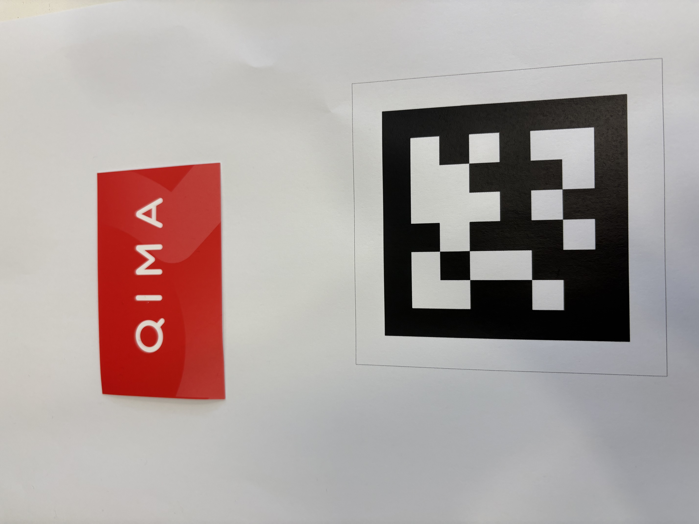
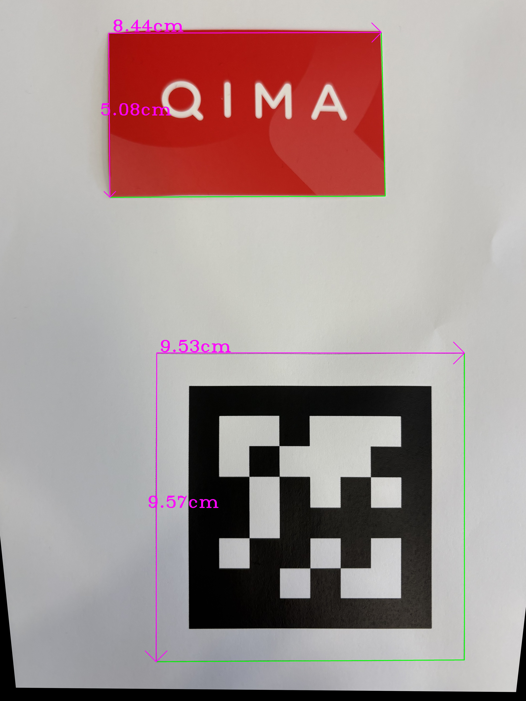

# <div align="center">Image Measurer</div>

<div align="center"><i>Measure objects within an image!</i></div>

***

## Table of Contents

- [Image Measurer](#image-measurer)
  - [Table of Contents](#table-of-contents)
  - [Introduction](#introduction)
  - [Installation](#installation)
  - [Usage](#usage)
  - [Example](#example)
  - [Contributing](#contributing)

## Introduction

This project allows you to upload an image with a reference [AprilTag](https://github.com/AprilRobotics/apriltag) to add annotations, measuring the sizes of objects in that image. See the [example](#example) section for an example.

## Installation

To install the required packages, run the following command:

```shell
pip install -r requirements.txt
```

Or, depending on your installation:

```shell
pip3 install -r requirements.txt
```

## Usage

To use the project, you can:

1. Install the required packages
2. Take a picture of your objects you wish to measure with the reference AprilTag in sight
3. Modify the parameters in `run.py`, specifically `IMAGE_PATH` and `FIDUCIAL_SIZE`. `IMAGE_PATH` should be the path of the desired image to measure the objects within, and `FIDUCIAL_SIZE` should be the size of the AprilTag in **centimeters** stored as a tuple `(width, height)`. *If you don't have your own image, feel free to experiment with our images! They're all located in the `/images` folder.*
4. Run the `run.py` file!

Once the program has run, the resulting image with the sizes annotated will be saved in `./output/result.jpg`.

> [!NOTE]
> Note that for best accuracy, please try to upload pictures with the least amount of shadow and with a large amount of lighting, and preferrably on a **white and simple background**. It is best to also take a bird's-eye-view image of the desired objects.

## Example

|  |  |
| - | - |
| Input | Output |

## Contributing

If you want to contribute to this project, please follow the guidelines below:

1. Fork the repository
2. Create a new branch for your changes
3. Make your changes and commit them
4. Push the new branch to your fork
5. Submit a pull request
